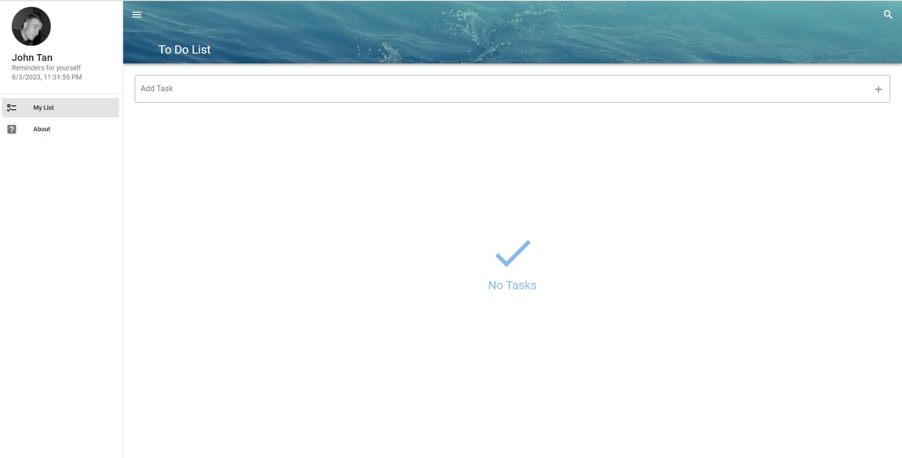

# Vue_ToDoList

## Description
The Vue To-Do List is a web application built using Vue.js that allows users to manage their tasks and create to-do lists. This project serves as a simple and efficient task management tool, providing an interactive user interface to add, delete, and mark tasks as completed.

## FeaturesS
- Add new tasks with task name
- Mark tasks as completed or uncompleted
- Delete tasks from the to-do list
- Responsive design for various devices

## Installation
To run the project locally, follow these steps:

### Install dependencies
npm install

### Run the development server
npm run serve

### Compiles and minifies for production
npm run build

## Usage
1. Add a new task:
- Enter the task name in the input field.
- Click the "+" icon or press the Enter key to add the task.

2. Mark a task as completed or uncompleted:
- Click the checkbox next to the task to toggle its completion status.

3. Delete a task:
- Click the delete icon associated with the task to remove it from the list.

